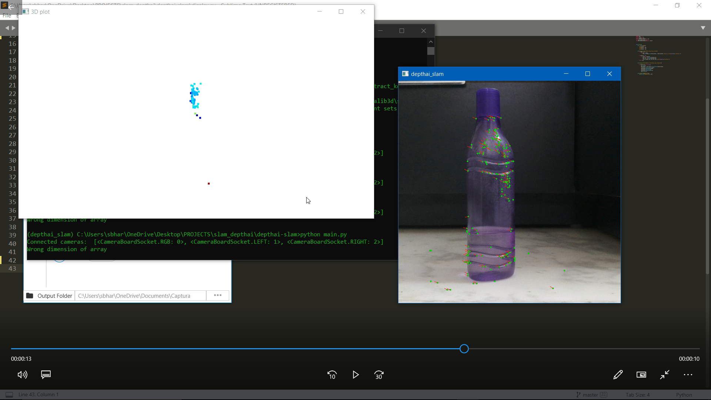

# depthai-slam

**SLAM: Simultaneous Localization and Mapping**\
Estimate the pose of a robot and the map of the environment at the same time using OAKs.

**OAKs ?**\
The OpenCV AI Kit (OAK-1) (OAK-D) is a smart camera with neural inference and depth processing capability. ... The capability of SpatialAI is to apply AI in this real world by not only identifying the object but also understanding where it is in 3D space — in real time.

SLAM is considered a fundamental problems for robots to become truly autonomous\
Large variety of different SLAM approaches have been developed
The majority uses probabilistic concepts

**use of SLAM**\
Absolute robot poses\
Absolute landmark positions\
and making them autonomous within..

**python env ver: 3.7**

demo:

  
 
 
 
 
 
 
 

